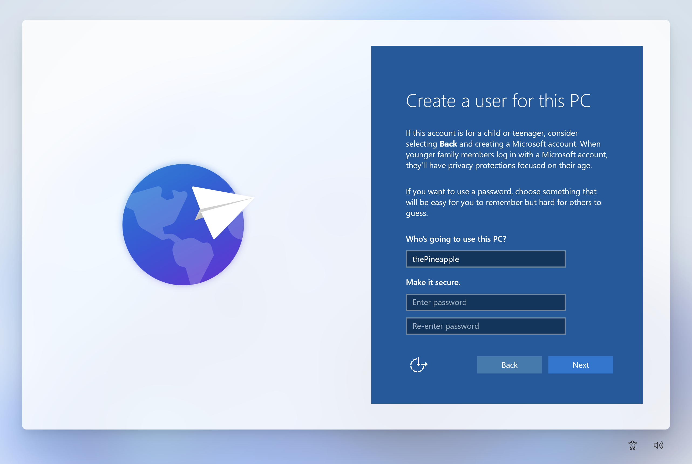
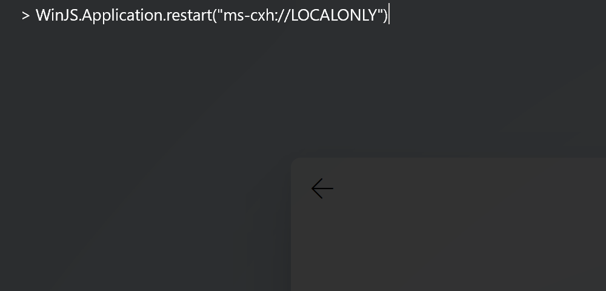

# WinJS-Microsoft-Account-Bypass

## **Overview**

This guide explains a method to bypass the Microsoft Account (MSA) requirement during the Windows 11 Out-Of-Box Experience (OOBE) by using the Developer Console to invoke a hidden local account setup screen. This method was discovered by examining the Windows 11 OOBE source code, which revealed an event listener for a hidden `_localAccountButton`.

Following these steps, you can create a local account without needing to sign in with or create a Microsoft account.



## **Steps to Bypass Microsoft Account Setup**

### 1. Disconnect from the Internet
   - Unplug the Ethernet cable if you have one, If you use WiFi, ignore this step.

### 2. Start Windows 11 Setup
   - Begin the Windows 11 Setup Process.
   - Select your region and keyboard layout.

### 3. Stop at the Secondary Keyboard Layout Screen
   - When you reach the **Secondary Keyboard Layout** screen, **do not click Skip**.
   - If you accidentally skipped and reached the Network Setup Screen, don't stress. I have a guide in the troubleshooting section.</a>

### 4. Open the Developer Console
   - Press **Ctrl + Shift + J** to open the Developer Console.
   - Your screen will go dark and will appear with a prompt (indicated by a `>` symbol) at the top left of the screen.
   > **Note:** If you can't open the console, troubleshooting steps are below.

### 5. Enter the Restart Command
   - Type the following command exactly as shown:
     ```javascript
     WinJS.Application.restart("ms-cxh://LOCALONLY")
     ```
> **Note:** This command is case-sensitive. You can use Tab-completion to help:

   - After typing `WinJS.A`, press **Tab** to auto-complete `Application`.
   - After typing `res`, press **Tab** to auto-complete `restart`.

### 6. Exit the Developer Console
   - After entering the command, press **Enter** to execute it.
   - Press **Escape** to exit the Developer Console and return to the OOBE interface.
   > **Note:** If the **Escape** key doesn't close the Console, click anywhere on the screen to ensure the console is focused and then press the key again.

### 7. Local Account Setup
   - The Secondary Keyboard Layout screen will refresh, and a **Windows 10-style local account setup screen** will appear.
   - Enter your desired **username**, **password**, and **security questions** and click **Next**.

### 8. Complete the Setup
   - The Setup will go black and will then log you in to your newly created account. Allow Windows 11 a few moments to configure the user.
   - Continue with the remaining privacy setting prompts.
   - Once finished, you will have successfully created a **local account** in Windows 11.

## **Troubleshooting**

- **Error when entering the command**:
   - Ensure the command is typed exactly as shown, including the case-sensitive parts. Use Tab-completion for accuracy.
   - Make sure the device is disconnected from the internet before running the command.
 


- **Developer Console not opening**:
   - If the Console does not appear, try to click outside of the white setup box to focus away from the setup options and try again.
   - If the Console still does not open, Microsoft may have patched this out. :(

- **I am stuck on a loading screen**:
   - If you do not see anything load after entering the command, you may have entered the URI (the text inside the brackets) incorrectly.
   - The safest way to get back to normal is to restart your computer by holding down the power button.
   - You can also restart the computer using Command Prompt or restart the Setup Application, you can find methods for these elsewhere.

- **I forgot to disconnect from the internet or I am stuck on the Network Setup or Microsoft Experience screens**:
   - You can either restart the computer to go back to the beginning of the install process (recommended).
   - Alternatively, you can connect to the internet and open the Developer Console on the "Name this Device" or the "Unlock your Microsoft Experience" screens (not recommended).
   - If you are here after a failed attempt of the OOBE\BYPASSNRO method, you would likely be at the "Unlock your Microsoft Experience" screen, you can still open the Developer Console here.
   > **Note:** If you are on a Microsoft Account Login Screen (prompting for email), The Developer Console is blocked. Restart your device if you cannot go back to the "Unlock your Microsoft Experience" screen.

## **Technical Details**
- The hidden `_localAccountButton` is referenced in the `js/errorHandler.js` file on **line 31**, where an event listener triggers the local account creation process when a local account button is pressed on an error screen.
- The command used by the button, `WinJS.Application.restart("ms-cxh://LOCALONLY")`, forces the OOBE to restart and runs a simple local account setup flow.

## **Additional Notes for Sysadmins**
- You can open the Developer Console from any screen of the OOBE, with the exception of the Network Connection Screen and the Microsoft Account Login screens. You can open the Developer Console from the Region Select Screen if you wish, but keep in mind that all default region settings are applied.
- This method is compatible with all Windows 11 versions to date, including 24H2 (Tested compatible on 26100.1742). There is a chance this could be compatible with Windows 10; do so at your own risk, as this has not been tested.
- This method should be compatible with all editions of Windows 11 as the Developer Console is embedded into the OOBE itself and does not rely on any external programs. Yes S-Mode users, this is compatible with you too.

## **Related Resources (Credits to Endermanch)**

- [Windows 11 OOBE GitHub Repository](https://github.com/Endermanch/Windows11OOBE) - For additional information and source code reference.
- [The secrets of the Windows installer](https://www.youtube.com/watch?v=tKtmzLpZ3RQ) - Deep dive into what goes on behind the scenes of the Windows Installer

